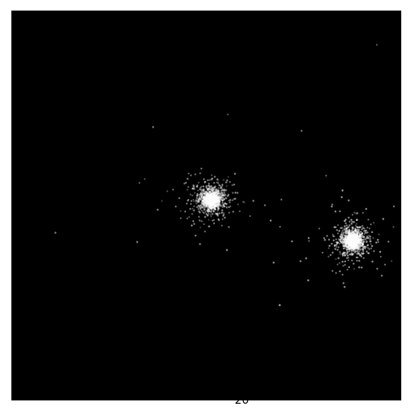

# CrAPS: C++ [reasonably] Accurate Particle Simulation

This code is an experiment in C++ using an astrophysical N-body sim as a model problem. 

<!--  -->

## Algorithm
Currently the code only uses a basic O(N^2) algorithm to compute the forces and then the leapfrog algorithm to do time propagation. 

There is one branch playing with encapsulating the particle data in a Particle class, the idea being that down the line we could play with different particle types and properties, but the breaking of cache locality in this situation seemed to have a big performance hit, so the master branch now just works on sets of vectors.

Currently the code is setup to do a boring collision of two Plummer spheres but more interesting things are planned.

## Building and running
Simply run

```
./run_build.sh 
```

from the main directory to run the cmake build, and then
```
./build/plummer_collission --nproc 4 --npar 200 --tmax 250
```
where the cmd line args are number of OpenMP threads, number of particles (split evenly between the two colliding clusters), and the max time, respectively. This is a bit of a pain to type each time especially to compare experiments so they will go in a config file eventually

#### Requirements
* C++11
* Boost
* OpenMP


## Todo
- [ ] Config file
- [x] Re-write force-calc loop to make use of symmetry of forces without breaking parallelism/imposing race conditions
- [x] Barnes-Hutt alg (almost finished, in other branch, some small niggles about reduction to direct sum problem as theta ->0)
- [ ] Choice of interesting initial conditions (disc collisions and so on)
- [ ] Better plotting/viz
- [ ] Hybrid MPI + OpenMP approach